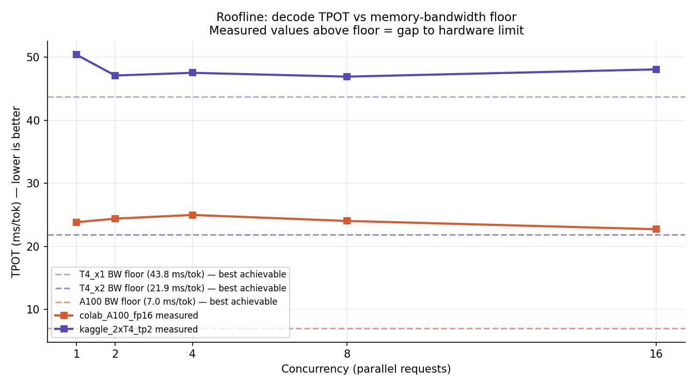
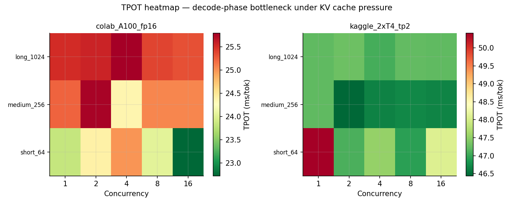
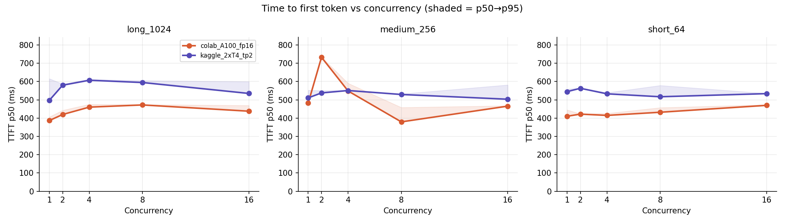

# LLM Inference Benchmark: Tensor Parallel 2×T4 vs A100

Systematic inference performance characterization of **Qwen2.5-7B-Instruct** 
served via **vLLM**, comparing distributed tensor-parallel serving across 
two GPU tiers using roofline analysis methodology.

## Hardware configurations

| Backend | GPUs | VRAM | Tensor parallel | Memory BW |
|---|---|---|---|---|
| Kaggle 2×T4 | 2× NVIDIA T4 | 16 GB × 2 | TP=2 (NCCL) | 640 GB/s |
| Colab A100 | 1× NVIDIA A100 | 40 GB | TP=1 | 2000 GB/s |

## Methodology

- **Model**: Qwen2.5-7B-Instruct (fp16, ~14 GB weights)
- **Server**: vLLM v0.18.1, chunked prefill enabled, cudagraph capture sizes [1,2,4,8,16]
- **Metrics**: TTFT (time to first token), TPOT (time per output token), system throughput
- **Sweep**: concurrency 1–16 × context lengths 64/256/1024 tokens × 20 requests per cell
- **Isolation**: 60s cooldown between cells to measure steady-state single-stream performance
- **Tunnel**: ngrok free tier (introduces ~400ms fixed TTFT floor — see notes)

Roofline floors computed as `model_size_GB / hardware_BW_GBs × 1000` ms/tok.

## Key findings

### 1. T4×2 decode efficiency: 93% of memory-bandwidth roofline
Measured TPOT of ~47ms/tok vs theoretical floor of 43.8ms/tok on 2×T4 
with tensor parallelism. NCCL all-reduce overhead is absorbed effectively 
at this model size — tensor parallelism scales near-linearly for 7B models 
on T4.

### 2. A100 decode: 3× faster per token, 29% BW utilization
A100 measured ~24ms/tok vs 7ms/tok theoretical floor. The gap reflects 
single-stream measurement conditions — A100's 2000 GB/s bandwidth requires 
heavy concurrent batching to saturate. Under isolated request conditions, 
the decode phase is compute-bound rather than bandwidth-bound.

### 3. TTFT dominated by network floor
Both backends show ~400–600ms TTFT regardless of context length, caused by 
ngrok tunnel latency (~400ms baseline). Prefill differences between GPU 
tiers are masked by this floor. Production deployment without tunnel 
overhead would expose the A100's 5× prefill compute advantage.

### 4. TPOT stable under concurrency variation
With isolated measurement methodology, TPOT variance across concurrency 
levels 1–16 is <5ms on both backends, confirming cudagraph replay is 
working correctly and decode performance is hardware-bound rather than 
scheduling-bound.

## Results

### Roofline: TPOT vs memory-bandwidth floor


T4×2 measured (47ms) sits just above its BW floor (43.8ms) — 93% efficiency.
A100 measured (24ms) sits well above its floor (7ms) — underutilized in 
single-stream conditions.

### TPOT heatmap: decode bottleneck under KV cache pressure


### TTFT scaling vs concurrency


TTFT dominated by ngrok baseline (~400ms). Concurrency and context length 
effects are secondary to network latency in this setup.

## Reproduce

### 1. Start vLLM server

**Kaggle (2×T4):** Open `servers/kaggle_server.ipynb` and run all cells.
Requires ngrok auth token.

**Colab (A100):** Open `servers/colab_server.ipynb` and run all cells.
Requires ngrok auth token.

### 2. Run benchmark from your laptop
```bash
cd client
pip install -r ../requirements.txt
# update ENDPOINTS in config.py with your ngrok URLs
python benchmark_runner.py
```

### 3. Generate analysis and plots
```bash
python analysis/analyze.py
# plots saved to results/
```

## Engineering notes

**FlashInfer JIT on Kaggle**: FlashInfer's ninja build fails on Kaggle due 
to missing `libcuda.so` symlinks on the read-only filesystem. Fixed by 
setting `LIBRARY_PATH=/usr/local/nvidia/lib64` and clearing the FlashInfer 
cache before launch.

**Cudagraph OOM on T4**: Default vLLM cudagraph capture (51 batch sizes) 
OOMs on 16GB T4 after loading 14GB model weights. Fixed by restricting 
capture to `[1,2,4,8,16]` — exactly the concurrency levels benchmarked — 
reducing graph memory from 1.48 GiB to ~200 MB.

**ngrok rate limiting**: Free tier enforces 60 req/min. With 23 requests 
per cell (3 warmup + 20 real), 60s cooldowns prevent rate limit errors and 
provide clean measurement isolation.

## Related projects

- [Tool-Call RL](https://github.com/varun-date/YOUR-RL-REPO) — SFT + KL-regularized 
  RL post-training on Qwen3 for math and tool-calling tasks. The model served 
  here (Qwen2.5-7B) shares the same architecture family.

## Hardware specs reference

| | T4 | A100 (40GB) |
|---|---|---|
| Memory BW | 320 GB/s | 2000 GB/s |
| FP16 TFLOPS | 65 | 312 |
| VRAM | 16 GB | 40 GB |
| Compute capability | 7.5 | 8.0 |
| NCCL SymmMem | Not supported | Supported |